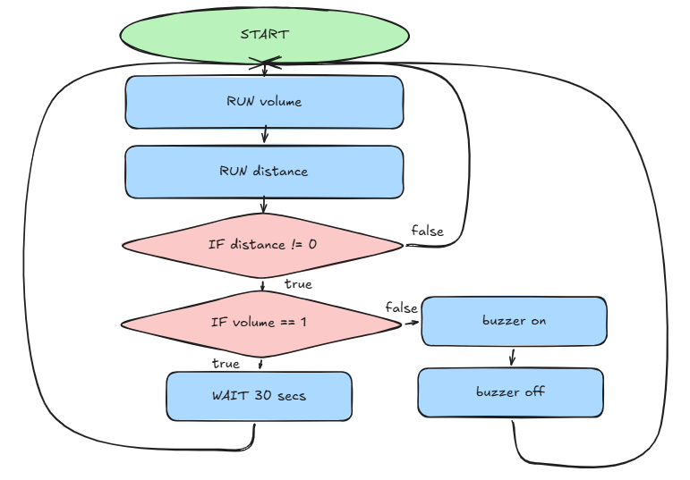
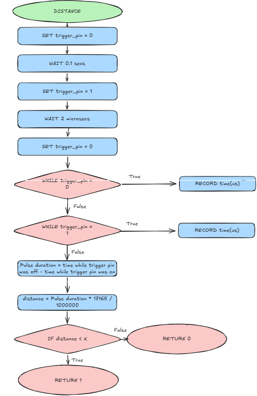

# Requirements outline

### The Need
My parents keep walking into my room without knocking, this doesnt matter at all but its the principal of the invasion of privacy. I need a way to make sure that I know when they enter
### Proposed Solutions
A device that detects wether or not a loud sound, such as kocking on a door has been made in the last three seconds, if there hasnt been a knock an ultrasonic sensor will detect if the door opens and play a loud sound to alert the person in the room. 

A device that detects movement outside the room and plays a loud sound if someone gets clost to the door
### Key Actions
 - Constantly detects sound level
 - Detects distance from door
 - Buzzer rings loudly if theres no sound and the door opens
 
 OR

- Constantly detects movement outside
- Buzzer rings loudly if theres movement outside

 ### Functional Requirements
 Volume sensor input: Detects if volume has exceeded boundary values
 Ultrasonic sensor input: Detects if an object has moved closer
 Volume output: Plays a loud sound when the ultrasonic sensor has detected movement and the volume sensor has not detected any sound exceeding boundary values

 OR

 Ultrasonic sensor input: Detects if an object has moved infront of it
 Volume output: Plays a loud sound when the ultrasonic sensor has detected movement.

 ### Test Cases

 | Test Case | Input     | Expected Output   |
|--------- |---------- |----------------   |
|     Decently loud sound is made      |     Volume sensor detects the increase in decibles      |        Plays loud sound (in the actual program it would move onto the next subroutine, this would just be a test to see if the volume sensor is working)           |
|       Object has moved    |     Ultrasonic sensor detects that an object has moved outside of the boundary values      |        Plays loud sound            |
|      Object has moved after a sound     |      Volume sensor has detected the sound + Ultrasonic sensor has detected movement     |          Does not activate the speaker         |

OR

| Test Case | Input     | Expected Output   |
|---------- |---------- |----------------   |
|     Something has moved infront of door    |     Ultrasonic sensor detects that an object has moved outside of the boundary values      |        Plays a loud sound           |

# Design
### Psuedocode:
WHILE TRUE
    volume = CALL volume
    distance =  CALL distance
    IF distance != 0 THEN
        IF volume == 1:
            WAIT 30 seconds
        ELSE:
                buzzer
        END IF
END WHILE

volume:

digital_output = READ digital output of microphone
RETURN digital_output

distance:

SET trigger_pin = 0 (off)
WAIT 0.1 seconds
SET trigger_pin = 1 (on)
WAIT 2 micro seconds
SET trigger_pin = 0
WHILE echo_pin is off
    pulse_start = time in millieseconds
WHILE echo_pin is off
    pulse_end = time in millieseconds
pulse_duration = pulse_end - pulse_start
distance = pulse_duration * 17165 / 1000000
IF distance < 500 (i dont know the value yet) THEN
    door_open = 1
else 
    door_open = 0
RETURN digital_output
### Algorithms





Prototype: 
 ```Python 

#TO DO:
#Create function that detects the current volume
#Create function that detects if an object infront of it has moved
#Create a function that plays a buzzer
#Put 'em allll together
#Important tutorials for doing these things:    2.6/2.4 2.8 2.9 2.10 3.3
#Ok wait so. I need it to detect the volume and only ring the buzzer when it doesnt detect something,##
#So I need it to be constantly reading the volume, but i also need to read the distance with the ultrasonic sensor at the same time##
#How???
#Maybe I could just like, switch between them very quickly like
# no sound. no move. no sound. no move. no sound. MOVE! BUZZ
#no sound. no move. SOUND!....(Movement takes place here but its paused).... no move. no sound. SOUND!....... etc etc? Would that work?

import machine
import time
from machine import Pin, ADC
trigger_pin = Pin(17, Pin.OUT)
echo_pin = Pin(16, Pin.IN, Pin.PULL_DOWN)
digital = Pin(18,Pin.IN, Pin.PULL_UP)
buzzer = Pin(19, Pin.OUT, value=0)
print("Hello world!")

def door_open():
    trigger_pin.value(0) #off
    time.sleep(0.1)
    trigger_pin.value(1) #on
    time.sleep_us(2)
    trigger_pin.value(0)

    while echo_pin.value() == 0:
        pass
    start_time = time.ticks_us() #records the time when the echo pin turns on

    while echo_pin.value() == 1:
        pass
    end_time = time.ticks_us() #records the time when the echo pin turns off

    duration = time.ticks_diff(end_time, start_time)
    distance = (duration * 0.0343) / 2

    if distance < 10:  # I DONT KNOW THE DISTANCE AGGG
        return 1
    else:
        return 0
    
def heard_sound():
    digital_value = digital.value()
    if digital_value == 0:
        return 1
    else:
        return 0
    
if __name__ == "__main__":
    while True:
        heard_sound()
        sound = heard_sound()
        door_open()
        move = door_open()
        print("Hello world!1")
        if sound == 0:
            for i in range(10):
                print("Hello world!2")
                door_open()
                if door_open() == 0:
                    print("Hello world!3")
                    time.sleep_us(1000)
                time.sleep_us(1)
        if move == 0:
            buzzer.on()
            print("Hello world!4")
            time.sleep(7)
            buzzer.off()


 ```
 The only problem with the prototype is that the ultrasonic sensor never picked anything up.

 ### Testing and debugging:
 This (thankfully) will actually be pretty short as the only problem with the program was that the ultrasonic sensor wouldnt activate, I can easily test whether its a wiring issue or a code issue by running a very simple test of the ultrasonic sensor.
 ```Python 
#Yes i jhust took this from the internet i dont careeeee i hate everything im genuinley gonna jump
# Load libraries
from machine import Pin
import time

# Initialization of GPIO16 as input and GPIO17 as output
trigger_pin = Pin(17, Pin.OUT)
echo_pin = Pin(16, Pin.IN, Pin.PULL_DOWN)

print("KY-050 Distance measurement")

# Endless loop for measuring the distance
while True:
     # Distance measurement is started using the 10us trigger signal
     trigger_pin.value(0)
     time.sleep(0.1)
     trigger_pin.value(1)

     # Now wait at the echo input until the signal has been activated 
     # Then the time is measured for how long it remains activated
     time.sleep_us(2)
     trigger_pin.value(0)
     while echo_pin.value()==0:
          pulse_start = time.ticks_us()
     while echo_pin.value()==1:
          pulse_end = time.ticks_us() 
     pulse_duration = pulse_end - pulse_start

     # Now the distance is calculated using the recorded time
     distance = pulse_duration * 17165 / 1000000
     distance = round(distance, 0)

     # Serial output
     print ('Distance:',"{:.0f}".format(distance),'cm')
     time.sleep(1)
```

```Python
from machine import Pin, ADC
from time import sleep
import utime
adc = ADC(0)
perchance = True
digital = Pin(18,Pin.IN, Pin.PULL_UP)
button = Pin(16, Pin.IN, Pin.PULL_UP)
trigger = Pin(14, Pin.OUT)
echo = Pin(15, Pin.IN)
mid = 1.96
max = 2
greg = 12.5
accordingtoallknownlawsofaviationthereisnowayabeeshouldbeabletofly = True
def ultra():
   trigger.low()
   utime.sleep_us(2)
   trigger.high()
   utime.sleep_us(5)
   trigger.low()
   while echo.value() == 0:
       signaloff = utime.ticks_us()
   while echo.value() == 1:
       signalon = utime.ticks_us()
   timepassed = signalon - signaloff
   distance = (timepassed * 0.0343) / 2
   return distance
def sond():
    raw_value = adc.read_u16()
    # Conversion from analog value to voltage
    Volm = round(raw_value* 3.3 / 65536, 2)
    Volt = Volm
    digital_value = digital.value()
    sleep(0.5)
    return Volt
def menu():
    while True:
        if button.value() == 0:
            print("off")
        else:
            IT = True
            if accordingtoallknownlawsofaviationthereisnowayabeeshouldbeabletofly == True:
                while IT == True:
                    ultra()
                    sond()
                    sound = sond()
                    distance = ultra()
                    print(sound)
                    print(distance)
                    if sound < mid or sound > max:
                       perchance = True
                    else:
                       perchance = False
                    if distance > greg:
                        if perchance == False:
                           print("alarm")
                    if button.value() != 0:
                        IT = False
menu()
```
The test from the ultrasonic sensor was actually somewhat inconclusive, as it always read the distance as 1 cm no matter what way it was facing. I fixed this issue, I was using 3.3V instead of VBUS, unfortunatley the VBUS decided to stop working, but im 100% sure my code works now.

Final code: 
```Python
import machine
import time
from machine import Pin, PWM
trigger_pin = Pin(17, Pin.OUT) #Sets up gpio17 as an output for the trigger pin of the ultrasonic sensor
echo_pin = Pin(16, Pin.IN, Pin.PULL_DOWN)#Sets up gpio16 as an input for the echo pin of the ultrasonic sensor
digital = Pin(18,Pin.IN, Pin.PULL_UP)#Sets up gpio18 as an input for the digital pin of the sound sensor
pwm_pin = PWM(Pin(19))#Sets gpio19 as a PWM output for the buzzer

# this sets up the frequency that the pin is turned off and on (it is not duty cycle)
pwm_pin.freq(1000)

# this varaible is used to help calculate the required input from a duty cycle percentage
max = 65535


def door_open(): #Returns a value of 1 or 0 depending on if the ultrasonic sensor detects an object within 30cm
    trigger_pin.value(0) #off
    time.sleep(0.1)
    trigger_pin.value(1) #on
    time.sleep_us(2)
    trigger_pin.value(0)

    while echo_pin.value() == 0:
        pass
    start_time = time.ticks_us() #records the time when the echo pin turns on

    while echo_pin.value() == 1:
        pass
    end_time = time.ticks_us() #records the time when the echo pin turns off

    duration = time.ticks_diff(end_time, start_time)
    distance = (duration * 0.0343) / 2 #calculates the distance using the speed of sound (343 m/s) and dividing by 2 to account for the round trip of the sound wave

    if distance < 30:  # I DONT KNOW THE DISTANCE AGGG
        return 1
    else:
        return 0
    
def heard_sound(): #Returns a value of 1 or 0 depending on if the sound sensor heard anything
    digital_value = digital.value()
    if digital_value == 0:
        return 1
    else:
        return 0
    
if __name__ == "__main__":
    while True:
        heard_sound()
        sound = heard_sound() #Checks and stores the value of the sound sensor
        door_open()
        move = door_open() #Checks and stores the value of the ultrasonic sensor
        print("I am running")
        if sound == 0:
            for i in range(10): #The for loop is used to check the ultra sonic sensor 10 times to continually check if the door is open or not
                print("I heard a sound")
                door_open()
                if door_open() == 1:
                    print("Door!")
                    time.sleep(4) #extra time to allow the door to be open longer if it was detected as to not buzz if somebody successfully knocked.
                time.sleep_us(1000)
        if move == 1: #If it detects that the door is open and it didnt hear a sound recently it plays a buzzer to alert the user that the door was opened.
            print("Youre so evil that youre kinda like a villain")

            PWM_value = int(0.5 * max)

            pwm_pin.duty_u16(PWM_value)
            time.sleep(5)
            pwm_pin.duty_u16(0)

```
# Peer evaluation
Liam Smith: Positive: Functional, and a very interesting concept, I like that it both uses sound and distance, very cool
Negative: Its really slow and ineffecient and sometimes doesnt register sound properly.
Implications: Very good highly functional, but could brush up on UX 
Ranking: 9/10

Oliver Reid-Konta: Positive: 

# Project evaluation
My mechatronnic device perfectly preforms the tasks outlined in my functional requirements with effectiveness, though sometimes it can miss a sound due to its slow processing time likely due to my somewhat inefficent code, which was caused mostly by having to learn how to actually do the hardware side of things at the same time as learning the code to use the hardware. On the project management side of things it definetly couldve been better as I spent a large majority of class time engrossed with other people projects rather than my own, in the end though everything did work so it couldnt've been that bad. In the end I think i couldve made sure I knew what I was doing in terms of hardware earlier and just tried to get things done quicker, as usual... But it was fully succesful multiple days before the due date so I'm definetly doing better, on top of this more care into protecting the parts couldve been given, maybe, honestly I dont know why the Pico broke its very annoying.